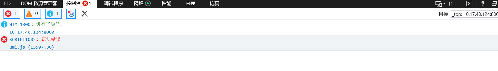
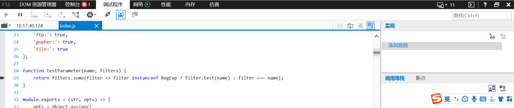

# bug 验证

## 依赖安装

```bash
yarn
```

## 启动

```bash
yarn start
```

## 验证错误

使用 IE11 浏览器，打开[http://localhost:8000](http://localhost:8000)，会看到如下错误：




经检查，该代码为`normalize-url`的实现，是被`mini-css-extract-plugin@0.6.0`引入到`umi.js`里的
